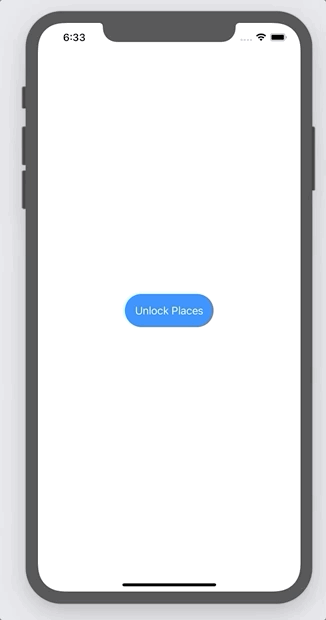

# InterestingPlaces

You can pin and edit interesting places to MapView. Also there is a list of suggestions from Wikipedia of interesting places from the pinned location.
To see your saved locations, you have to authenticate yourself with FaceID or TochID if the App starts for security reasons .

# Authentication with FaceID 

# Pin location to MapView

# Edit selected pin location

